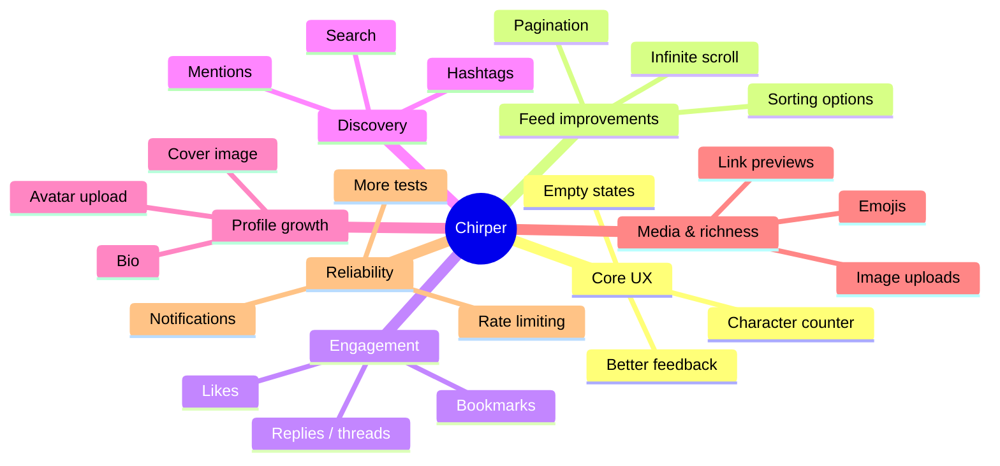

# Chirper Feature Roadmap

This roadmap breaks the app into small, buildable phases so you can implement features one by one.

## Mind map view

## Feature table

| Feature | Why it matters | Suggested priority | Typical implementation area |
|---|---|---:|---|
| Pagination / infinite scroll | Lets the feed scale beyond the current limited view | High | Controller, feed view |
| Replies / threads | Makes chirps feel more conversational | High | Database, controller, Blade components |
| Likes / bookmarks | Adds core social engagement | High | Models, migrations, views |
| Hashtags / search | Helps users discover content faster | Medium | Query logic, filter UI |
| Mentions | Improves interaction and usability | Medium | Text parsing, notification hooks |
| Profile bio / avatar upload | Makes profiles more personal | Medium | User model, profile forms |
| Image uploads for chirps | Adds richness to posts | Medium | Storage, validation, post form |
| Notifications | Keeps users engaged with activity | Medium | Notification system, UI |
| Character counter / draft support | Improves writing experience | Low | Form UX |
| Rate limiting | Adds protection against spam | Low | Middleware / request handling |

## Suggested implementation order

### Phase 1 — Foundation polish
- Improve empty states and onboarding hints
- Add toast/success feedback for post actions
- Add a character counter for chirp input

### Phase 2 — Feed improvements
- Replace the fixed 10-item feed with pagination
- Add sorting options (newest, oldest, most liked)
- Add a simple load-more or infinite scroll behavior

### Phase 3 — Engagement features
- Add likes for chirps
- Add bookmarks for saved posts
- Add reply/thread support

### Phase 4 — Discovery features
- Support hashtags in chirp text
- Add mention handling for `@username`
- Add a search bar for searching chirps by text

### Phase 5 — Profile and media
- Add profile bio and optional avatar upload
- Allow image attachments on chirps
- Improve profile pages and account settings

### Phase 6 — Reliability and growth
- Add rate limiting to posting actions
- Add notifications for replies, mentions, and likes
- Expand test coverage for auth, feed, and profile flows

## Suggested checklist format

Use this while working through each feature:

- [ ] Define the database/model change
- [ ] Add validation rules if needed
- [ ] Update the controller logic
- [ ] Update Blade views/components
- [ ] Add or update tests
- [ ] Verify manually in the browser
